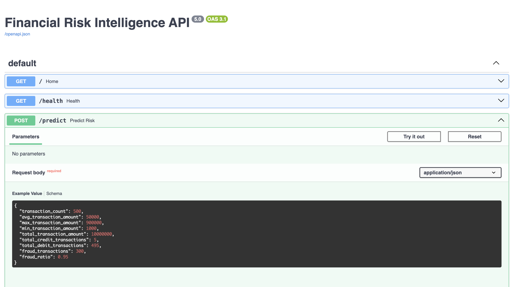
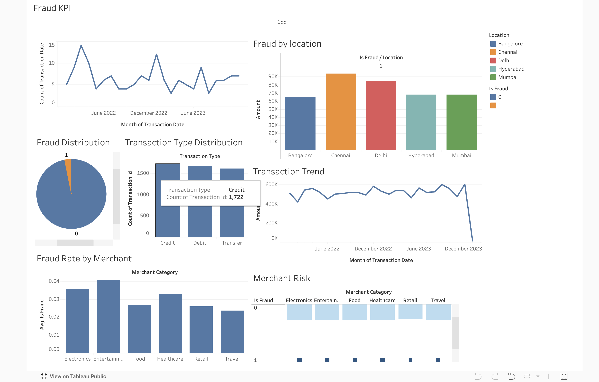
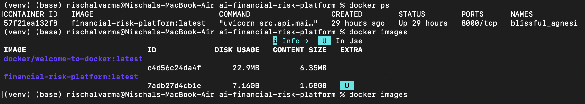
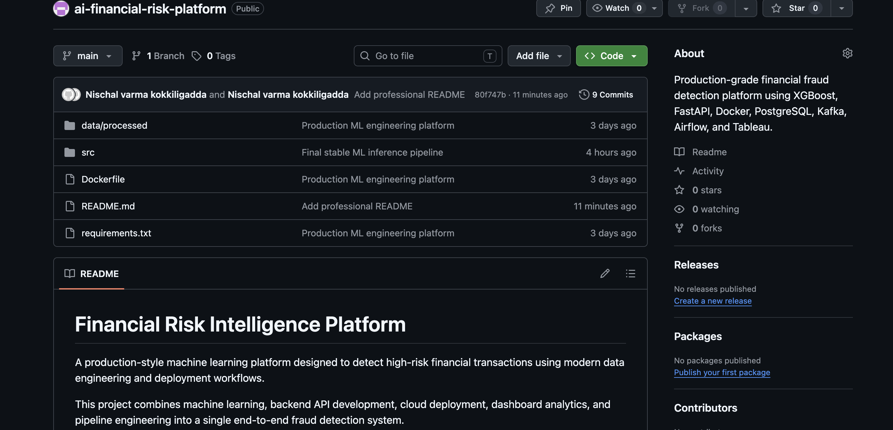
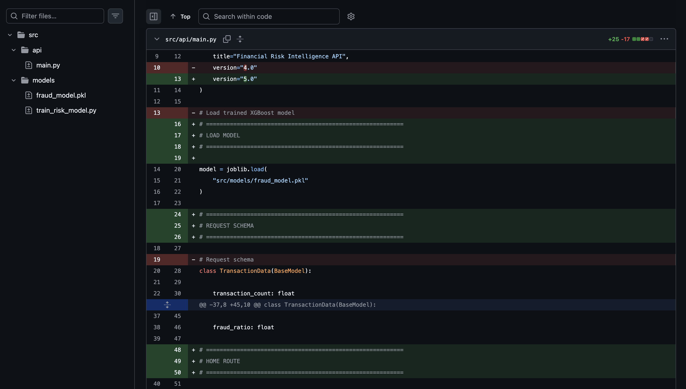
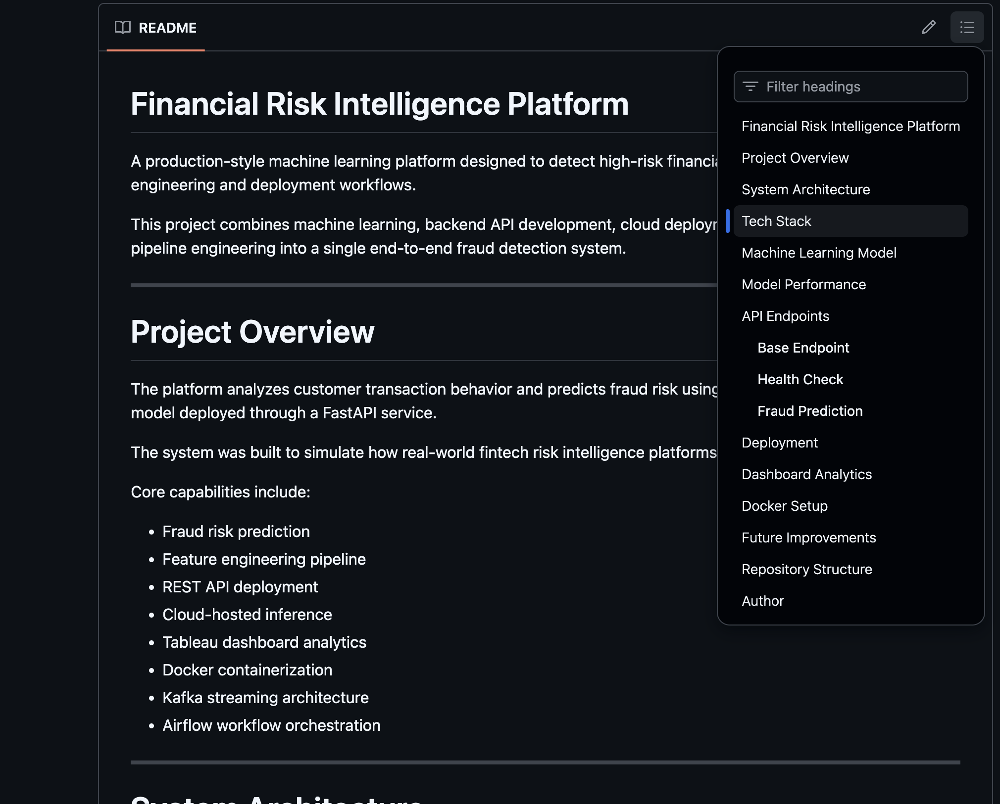

# Financial Risk Intelligence Platform

[Live API Deployment](https://ai-financial-risk-platform.onrender.com/docs)

A production-style machine learning platform designed to detect high-risk financial transactions using modern data engineering and deployment workflows.

This project combines machine learning, backend API development, cloud deployment, dashboard analytics, and pipeline engineering into a single end-to-end fraud detection system.

---

# Project Overview

The platform analyzes customer transaction behavior and predicts fraud risk using an XGBoost machine learning model deployed through a FastAPI service.

The system was built to simulate how real-world fintech risk intelligence platforms are designed and deployed.

Core capabilities include:

- Fraud risk prediction
- Feature engineering pipeline
- REST API deployment
- Cloud-hosted inference
- Tableau dashboard analytics
- Docker containerization
- Kafka streaming architecture
- Airflow workflow orchestration

---

# System Architecture

```text
Kafka
  ↓
Airflow
  ↓
PostgreSQL
  ↓
Feature Engineering
  ↓
XGBoost Machine Learning Model
  ↓
FastAPI Service
  ↓
Docker Container
  ↓
Render Cloud Deployment
  ↓
Tableau Dashboard
```
---
# Architecture Diagram
[Architecture](images/architecture.png)
---

# Tech Stack

| Layer | Technology |
|---|---|
| Database | PostgreSQL |
| Data Processing | Python |
| Feature Engineering | Pandas + SQL |
| Machine Learning | XGBoost |
| API Framework | FastAPI |
| Containerization | Docker |
| Cloud Deployment | Render |
| Dashboard Analytics | Tableau |
| Streaming Pipeline | Kafka |
| Workflow Orchestration | Airflow |

---

# Machine Learning Model

The fraud detection engine uses an XGBoost classification model trained on engineered financial transaction features.

Features used during training:

- Transaction count
- Average transaction amount
- Maximum transaction amount
- Minimum transaction amount
- Total transaction amount
- Credit transaction volume
- Debit transaction volume
- Fraud transaction count
- Fraud ratio

The model predicts:

- Fraud probability
- Risk classification

---

# Model Performance

| Metric | Score |
|---|---|
| Accuracy | 99% |
| Model Type | XGBoost |
| Prediction Task | Fraud Classification |

---

# API Endpoints

## Base Endpoint

```http
GET /
```

Response:

```json
{
  "message": "Financial Risk Intelligence API Running"
}
```

---

## Health Check

```http
GET /health
```

Response:

```json
{
  "status": "healthy"
}
```

---

## Fraud Prediction

```http
POST /predict
```

Example Request:

```json
{
  "transaction_count": 500,
  "avg_transaction_amount": 50000,
  "max_transaction_amount": 900000,
  "min_transaction_amount": 1000,
  "total_transaction_amount": 10000000,
  "total_credit_transactions": 5,
  "total_debit_transactions": 495,
  "fraud_transactions": 300,
  "fraud_ratio": 0.95
}
```

Example Response:

```json
{
  "fraud_probability": 0.9903,
  "risk_level": "HIGH RISK"
}
```

---

# Deployment

The application is deployed publicly using Render and containerized using Docker.

Live API:

```text
https://ai-financial-risk-platform.onrender.com/docs
```

---

# Dashboard Analytics

The Tableau dashboard provides interactive fraud monitoring and transaction analysis.

Dashboard components include:

- Fraud KPI tracking
- Fraud distribution analysis
- Merchant category risk analysis
- Transaction trend monitoring
- Fraud location analytics
- Fraud ratio visualization

---

# Docker Setup

Build Docker container:

```bash
docker build -t financial-risk-platform .
```

Run container locally:

```bash
docker run -p 8000:8000 financial-risk-platform
```

---

# Future Improvements

Planned upgrades for the platform:

- Real-time fraud streaming
- MLflow experiment tracking
- CI/CD automation
- AWS cloud migration
- Kubernetes deployment
- Advanced monitoring pipelines
- Real-world financial datasets
- Model drift detection

---

# Repository Structure

```text
ai-financial-risk-platform/
│
├── data/
├── dashboard/
├── src/
│   ├── api/
│   ├── models/
│   ├── features/
│   ├── data_pipeline/
│   └── deep_learning/
│
├── Dockerfile
├── requirements.txt
└── README.md
```
# API Screenshot



---

# Tableau Dashboard



---

# Docker Deployment



---

# GitHub Repository

## Repository Overview



---




---




---

# Author

Nischal Varma Kokkiligaddas